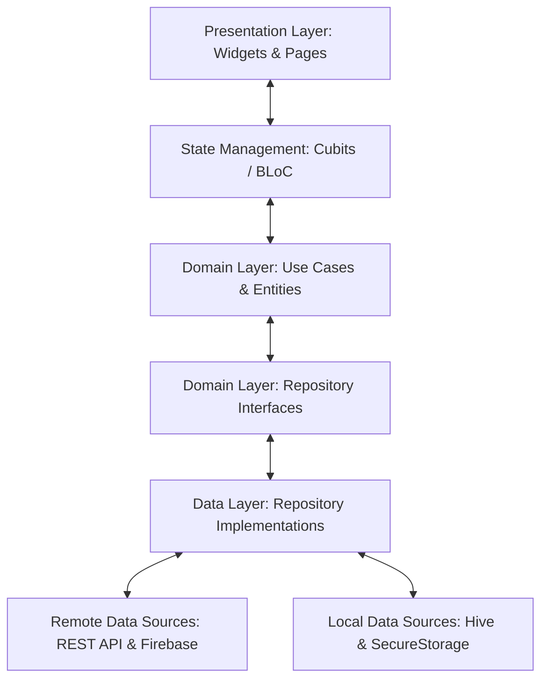

<div align="center">

  # 🚗 Waslni — Smart Ride-Hailing & Carpooling Platform

  **A production-ready, high-performance Flutter mobile application for real-time ride-hailing, carpooling, and intelligent GPS driver navigation.**

  [](https://flutter.dev)
  [](https://dart.dev)
  [](https://blog.cleancoder.com/)
  [](https://bloclibrary.dev/)
  [](https://firebase.google.com/)
  [](https://cloud.google.com/maps-platform)
  [](#)
  [](LICENSE)

  [English](#-english) • [العربية](#-عربي) • [Key Features](#-key-features) • [Screenshots](#-screenshots) • [Architecture](#-architecture--design-patterns) • [Tech Stack](#-tech-stack) • [Getting Started](#-getting-started)

</div>

---

## 📖 Overview

**Waslni** is an enterprise-grade, full-featured transportation application built with Flutter. It connects passengers and drivers through two flexible trip models:

1. **Private Trips (On-Demand / Taxi)** — Direct door-to-door rides with a dynamic bidding system where drivers submit competing price offers.
2. **Shared Trips (Carpooling)** — Cost-effective group rides where drivers or passengers create routes and passengers book individual seats.

The application features **Google Maps-style 3D turn-by-turn navigation**, sub-second GPS live location streaming via **Cloud Firestore**, real-time **in-app chat**, and intelligent **geofencing**.

---

## 📱 Screenshots

### 1. Onboarding & Verification

<table>
<tr>
<td align="center" width="220">
<br/>
<sub><b>Welcome</b></sub>
</td>
<td align="center" width="220">
<br/>
<sub><b>Document Verification</b></sub>
</td>
<td align="center" width="220">
<br/>
<sub><b>Home Page</b></sub>
</td>
</tr>
</table>

### 2. Booking a Ride

<table>
<tr>
<td align="center" width="220">
<br/>
<sub><b>Select Destination</b></sub>
</td>
<td align="center" width="220">
<br/>
<sub><b>Request Pending</b></sub>
</td>
<td align="center" width="220">
<br/>
<sub><b>Fare Offer</b></sub>
</td>
<td align="center" width="220">
<br/>
<sub><b>Accept Offer</b></sub>
</td>
</tr>
</table>

### 3. Live Trip Tracking

<table>
<tr>
<td align="center" width="220">
<br/>
<sub><b>Driver En Route</b></sub>
</td>
<td align="center" width="220">
<br/>
<sub><b>Driver Approaching</b></sub>
</td>
<td align="center" width="220">
<br/>
<sub><b>Driver Arrived</b></sub>
</td>
<td align="center" width="220">
<br/>
<sub><b>Trip In Progress</b></sub>
</td>
</tr>
</table>

### 4. Post-Trip

<table>
<tr>
<td align="center" width="220">
<br/>
<sub><b>Rate the Trip</b></sub>
</td>
<td align="center" width="220">
<br/>
<sub><b>Trip History</b></sub>
</td>
</tr>
</table>

### 5. Communication & Account

<table>
<tr>
<td align="center" width="220">
<br/>
<sub><b>Chat with Driver</b></sub>
</td>
<td align="center" width="220">
<br/>
<sub><b>Driver Ratings</b></sub>
</td>
<td align="center" width="220">
<br/>
<sub><b>Notifications</b></sub>
</td>
<td align="center" width="220">
<br/>
<sub><b>Settings</b></sub>
</td>
</tr>
</table>

### 6. Driver App

<table>
<tr>
<td align="center" width="220">
<br/>
<sub><b>Driver Dashboard</b></sub>
</td>
</tr>
</table>

---

## ✨ Key Features

### 👤 Passenger Experience
- **Instant & Scheduled Bookings**: Request an immediate ride or schedule a trip for a future date and time.
- **Dynamic Bidding & Offers**: Receive multiple offers from nearby drivers, view driver ratings, vehicle details, and accept the best price.
- **Carpooling / Seat Sharing**: Search and book available seats on shared routes with gender-preference filters and transparent per-seat pricing.
- **Live Ride Tracking**: Track driver approach in real-time with continuous distance remaining and accurate Estimated Time of Arrival (ETA).
- **Saved Locations**: Bookmark frequent destinations (Home, Work, Favorites) for one-tap trip creation.

### 🚘 Driver Experience
- **Nearby Trip Radar**: Real-time broadcast radar displaying active ride requests and passenger pickups nearby.
- **Custom Price Bidding**: Propose competitive pricing within system-defined minimum and maximum fare boundaries.
- **Turn-by-Turn Navigation Camera**:
  - **3D Navigation Perspective**: Automatic 45° tilt with camera rotation matching the vehicle's heading (`bearing`).
  - **Zero-Lag Polyline Trimming**: Instant in-memory clipping (0ms) of traversed roads as the driver advances.
  - **Ultra-Fast Rerouting**: Automatic off-route detection (>45m) with road recalculation in **under 250ms**.
  - **Interactive Free-Roam**: Pan and zoom freely to inspect the route; automatically recenters after 8 seconds of inactivity.
- **Document & Vehicle Verification**: Driver onboarding flow supporting driver's license, vehicle registration, and identity verification.

### 📡 Real-Time & Communications
- **Sub-Second GPS Broadcasting**: Low-latency vehicle telemetry streamed through Firebase Cloud Firestore.
- **Real-Time In-App Chat**:
  - Direct 1-on-1 trip chat between passenger and driver.
  - Multi-passenger group chat for shared carpool trips with live unread badge counters.
- **FCM Push Notifications**: Deep-linked push notifications for ride requests, price offers, trip acceptance, cancellations, and driver arrival.
- **Automated Geofencing**: 200-meter proximity validation verifying driver arrival before enabling boarding state transitions.

### 🛡️ Safety, Rating & Resilience
- **Two-Way Rating System**: Interactive 5-star ratings and reviews for both drivers and passengers.
- **Offline Connectivity Banner**: Real-time network listener alerting users when cellular connection drops.
- **Dual Routing Fallback**: Primary Google Directions API paired with an ultra-fast OSRM circuit breaker ensuring 100% map availability.
- **Full Internationalization (i18n)**: Native support for Arabic (RTL) and English (LTR) with seamless in-app locale switching.

---

## 🏗 Architecture & Design Patterns

The project is structured according to **Clean Architecture** principles combined with the **BLoC (Business Logic Component)** pattern, ensuring separation of concerns, testability, and maintainability.



### Layer Responsibilities
- **`core/`**: Cross-cutting infrastructure, dependency injection, theme tokens, custom widgets, network clients, route definitions, and security validators.
- **`features/*/presentation/`**: Screen layouts, reusable UI components, and state management via **Cubit**.
- **`features/*/domain/`**: Pure business rules, entities, and repository contracts (zero framework dependencies).
- **`features/*/data/`**: Data models (with JSON serialization), API endpoints, remote data sources (Dio / Firestore), and local storage caching.

---

## 📂 Directory Structure

```text
lib/
├── core/
│   ├── data/             # Shared data models & pagination
│   ├── di/               # Service locator (GetIt) dependency injection
│   ├── error/            # Failure types & exception handling
│   ├── network/          # Dio client, interceptors & API endpoints
│   ├── router/           # GoRouter configuration & deep link handlers
│   ├── services/         # GPS tracking, FCM, RemoteConfig & Geofencing
│   ├── storage/          # Hive, SharedPreferences & SecureStorage
│   ├── theme/            # Color palettes, typography & map styling
│   └── widgets/          # Shared components, banners & dialogs
├── features/
│   ├── auth/             # Login, signup (Driver & Passenger), OTP verification
│   ├── chat/             # 1-on-1 & shared group trip chat (Firestore)
│   ├── driver_documents/ # Document upload & verification
│   ├── home/             # Passenger & Driver home dashboards
│   ├── legal/            # Privacy policy & terms of service
│   ├── map/              # Dual routing engine (Google + OSRM) & geocoding
│   ├── notifications/    # In-app notifications & history
│   ├── onboarding/       # Walkthrough screens & language selection
│   ├── ratings/          # Rating dialogs, pending & submitted reviews
│   ├── settings/         # Profile management & saved locations
│   └── trips/            # Private & shared trip workflows (Passenger & Driver)
├── generated/            # Flutter Intl code-generated classes
├── l10n/                 # Localization ARB files (Arabic & English)
├── firebase_options.dart # Firebase platform configuration
└── main.dart             # Application entry point & global providers
```

---

## 🛠 Tech Stack

| Category | Technology / Package | Description |
| :--- | :--- | :--- |
| **Framework** | [Flutter 3.x](https://flutter.dev) | Cross-platform UI toolkit |
| **Language** | [Dart 3.x](https://dart.dev) | Strongly-typed, null-safe language |
| **State Management** | [`flutter_bloc`](https://pub.dev/packages/flutter_bloc) | Predictable, reactive state management |
| **Routing** | [`go_router`](https://pub.dev/packages/go_router) | Declarative routing with deep linking |
| **Dependency Injection**| [`get_it`](https://pub.dev/packages/get_it) | Fast service locator pattern |
| **Maps & Navigation** | [`google_maps_flutter`](https://pub.dev/packages/google_maps_flutter) | High-performance interactive Google Maps |
| **Location Engine** | [`geolocator`](https://pub.dev/packages/geolocator) & [`geocoding`](https://pub.dev/packages/geocoding) | GPS coordinates & reverse address lookup |
| **Networking** | [`dio`](https://pub.dev/packages/dio) | HTTP client with interceptors & token refresh |
| **Cloud & Realtime** | [`cloud_firestore`](https://pub.dev/packages/cloud_firestore) | Sub-second driver location sync & live chat |
| **Push Notifications** | [`firebase_messaging`](https://pub.dev/packages/firebase_messaging) | Remote alerts with foreground heads-up banners |
| **Local Storage** | [`hive_flutter`](https://pub.dev/packages/hive_flutter) | High-performance NoSQL local key-value store |
| **Secure Storage** | [`flutter_secure_storage`](https://pub.dev/packages/flutter_secure_storage) | Keychain / Keystore encrypted auth tokens |
| **Internationalization**| [`flutter_localizations`](https://api.flutter.dev/flutter/flutter_localizations/flutter_localizations-library.html) | Arabic (RTL) & English (LTR) |

---

## 📄 License

This project is licensed under the **MIT License** — see the [LICENSE](LICENSE) file for details.

---

<div align="center">
  <sub>Developed with ❤️ using Flutter & Dart.</sub>
</div>
